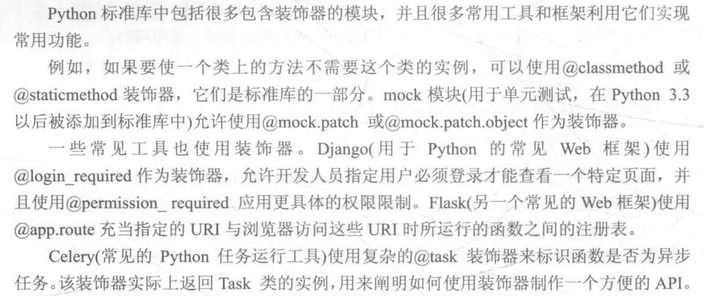
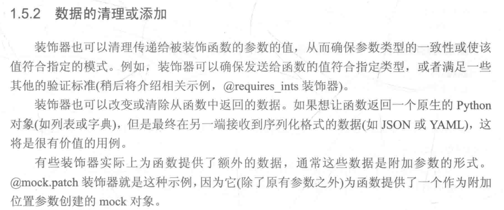

<h1 style="text-align: center;">1.装饰器</h1>

# 1 装饰器

```python
import functools


def outer(func):
    @functools.wraps(func)
    def inner(*args, **kwargs):
        ...
        res = func(*args, **kwargs)
        ...
        return res
    return inner

```





一个很重要的注意事项是：当装饰器应用到装饰函数时（而不是调用装饰器时），会执行装饰代码本身。理解这一点至关重要，通过接下来的几个示例，会对其有清晰的理解。


