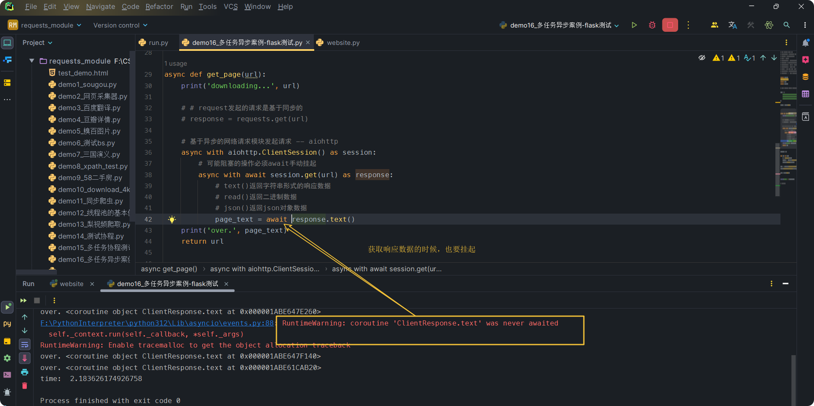
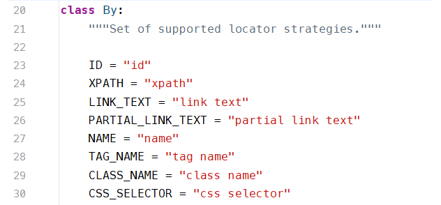

<h1 style="font-family: 'Menlo'; text-align: center;">requests模块</h1>

[TOC]

# 1 requests

如何使用：

- 指定url
- 发起请求
- 获取响应数据
- 持久化存储

## 1.1 需求：爬取搜狗首页的页面数据

```python
import requests

# 指定url
url = "https://www.sogou.com/"

# 发起请求 get方法会返回一个响应对象
response = requests.get(url=url)

# 获取响应数据 text返回的是字符串形式的数据
text_get = response.text

# 持久化存储
with open("./data/sougou.html", "w", encoding="utf-8") as fp:
    fp.write(text_get)
```

## 1.2 需求：简易网页采集器

UA伪装：User-Agent

```python
import requests

if __name__ == '__main__':

    url = "https://www.sogou.com/web"
    headers = {
        'User-Agent': 'Mozilla/5.0 (Windows NT 10.0; Win64; x64) AppleWebKit/537.36 '
                      '(KHTML, like Gecko) Chrome/99.0.4844.84 Safari/537.36 HBPC/12.1.3.310',
    }
    # 处理url携带的参数 -- 封装到字典中
    keywords = input("输入你想搜索的关键字")
    params = {
        'query': keywords,
    }
    # 对指定的url发起的请求是携带参数的 并且请求过程已经处理了参数
    response = requests.get(url=url, params=params, headers=headers)

    page_text = response.text.replace("\n", " ")

    file_name = './data/' + keywords + '.html'
    with open(file_name, 'w', encoding="utf-8") as fp:
        fp.write(page_text)
        print(file_name, "保存成功")
```

## 1.3 需求：百度翻译

我们发现，我们在翻译框输入一些东西，自动出现翻译结果 -- 页面局部刷新（ajax实现）

post请求 携带了参数 响应数据是一组json数据

```python
import requests
import json

if __name__ == '__main__':

    url = "https://fanyi.baidu.com/sug"
    # UA伪装
    headers = {
        'User-Agent': 'Mozilla/5.0 (Windows NT 10.0; Win64; x64) AppleWebKit/537.36 '
                      '(KHTML, like Gecko) Chrome/99.0.4844.84 Safari/537.36 HBPC/12.1.3.310',
    }
    # 输入关键字
    keywords = input("请输入要翻译的文本: >>> ")
    # 传入的数据
    data = {
        "kw": keywords,
    }
    # 发送请求 获取返回的数据
    response = requests.post(url=url, data=data, headers=headers)
    # 直接返回一个字典对象 如果确认服务器响应数据是json类型的，就可以用json这个方法
    dict_obj = response.json()
    file_name = "./data/{}.json".format(keywords)
    with open(file_name, "w", encoding="utf-8") as fp:
        json.dump(dict_obj, fp=fp, ensure_ascii=False)
        print(file_name, "存储成功")
```

## 1.4 爬取豆瓣电影的详情数据

```python
import requests
import json

if __name__ == '__main__':
    url = "https://movie.douban.com/j/chart/top_list?type=24&interval_id=100%3A90&action=&start=0&limit=20"
    # UA伪装
    headers = {
        'User-Agent': 'Mozilla/5.0 (Windows NT 10.0; Win64; x64) AppleWebKit/537.36 '
                      '(KHTML, like Gecko) Chrome/99.0.4844.84 Safari/537.36 HBPC/12.1.3.310',
    }

    params = {
        'type': '24',
        'interval_id': '100:90',
        'action': '',
        'start': '0',
        'limit': '20',
    }

    response = requests.get(url=url, headers=headers, params=params)
    list_data = response.json()
    with open("./data/douban.json", "w", encoding="utf-8") as fp:
        json.dump(obj=list_data, fp=fp, ensure_ascii=False)
        print("文件下载完毕")
```

# 2 数据解析bs4、xpath(重点)、正则

## 2.1 正则

需求：爬取糗事百科的糗图板块下所有糗图文件

先写一个测试：

```python
import requests
import json

if __name__ == '__main__':
    url = "https://pic.3gbizhi.com/uploads/20240612/8bb1246c67b21da426529660d0a2a52b.png"
    # UA伪装
    headers = {
        'User-Agent': 'Mozilla/5.0 (Windows NT 10.0; Win64; x64) AppleWebKit/537.36 '
                      '(KHTML, like Gecko) Chrome/99.0.4844.84 Safari/537.36 HBPC/12.1.3.310',
    }
    # content返回的是二进制数据
    response = requests.get(url=url, headers=headers).content

    file_name = "./data/" + url.split("/")[-1]
    with open(file_name, "wb") as fp:
        fp.write(response)
        print(file_name, "保存成功")
```

实现这个案例：

```python
import requests
import json
import re

if __name__ == '__main__':

    # UA伪装
    headers = {
        'User-Agent': 'Mozilla/5.0 (Windows NT 10.0; Win64; x64) AppleWebKit/537.36 '
                      '(KHTML, like Gecko) Chrome/99.0.4844.84 Safari/537.36 HBPC/12.1.3.310',
    }

    for k in range(1, 26):
        url = "https://desk.3gbizhi.com/deskMV/index_{}.html".format(k)
        # 获取当前url的页面文本数据
        page_text = requests.get(url, headers=headers).text
        # 聚焦爬虫 解析数据
        ex = r'<li class="box_black">.*?lay-src="(.*?)" alt.*?</li>'
        url_list = re.findall(ex, page_text, re.S)  # re.S单行匹配 re.M多行匹配
        for item in url_list:
            file_name = "./data/images/" + item.split("/")[-1]
            img_content = requests.get(item, headers=headers).content
            with open(file_name, "wb") as fp:
                fp.write(img_content)
                print(file_name, "下载完成！")
```

## 2.2 bs4--python独有

解析原理：

- 实例化一个bs对象 将页面源码数据加载都该对象中
- 通过bs对象中相关的属性或者方法对标签进行定位和数据提取

```python
pip install bs4
pip install lxml
```

```python
# 实例化bs对象

form bs4 import BeautifulSoup

# 本地的文档加载
# 将本地html中数据加载到对象中
with open("./test_demo.html", "r", encoding="utf-8") as fp:
    soup = BeautifulSoup(fp, "lxml")
    print(soup)

    
# 网络上获取的数据的加载
# 从互联网中获取
url = "https://www.3gbizhi.com/wallMV/index_2.html"

headers = {
    'User-Agent': 'Mozilla/5.0 (Windows NT 10.0; Win64; x64) AppleWebKit/537.36 '
                  '(KHTML, like Gecko) Chrome/99.0.4844.84 Safari/537.36 HBPC/12.1.3.310',
}
page_text = requests.get(url, headers=headers).text
soup = BeautifulSoup(page_text, "lxml")
```

提供的用于解析数据的方法和属性

```python
soup.标签名 -- 返回整个html文档中第一次出现的这个标签名

print(soup.a)  # 找到整个文档的第一个a标签
print(soup.div)  # 找到整个文档的第一个div标签
```

```python
soup.find('标签名')  -- 返回整个html文档中第一次出现的这个标签名 同soup.标签名
print(soup.find('div', class_='head_b_menu')) -- 根据属性定位第一个满足的标签 class_/id/attr
print(soup.find('div', id="pageNum"))
print(soup.find('a', attrs={'title': '首页'}))
```

```python
print(soup.find_all('a'))  # 返回的是符合要求的所有标签 --- 列表
```

```python
print(soup.select('.tips'))  # 返回的是一个列表 找出所有的
print(soup.select('.topmenuc > div > a > img'))  # 层级选择器 一个层级
print(soup.select('.topmenuc > div > a > img')[0])
```

```python
print(soup.select('.topmenuc > div img'))  # 层级选择器 多个层级
print(soup.select('.topmenuc > div img')[0])
```

获取文本值和属性

```python
print(soup.a.text)  #
print(soup.a.string)  # 只能获取该标签下面直系的文本
print(soup.a.get_text())  # 可以获取所有文本内容 不是直系的也可以获取
```

```python
print(soup.a['href'])
```

需求：爬取三国演义小说所有的章节标题和内容

```python
import requests
from bs4 import BeautifulSoup
import json


def main():
    url = "https://www.shicimingju.com/book/sanguoyanyi.html"
    # UA伪装
    headers = {
        'User-Agent': 'Mozilla/5.0 (Windows NT 10.0; Win64; x64) AppleWebKit/537.36 '
                      '(KHTML, like Gecko) Chrome/99.0.4844.84 Safari/537.36 HBPC/12.1.3.310',
    }

    response = requests.get(url=url, headers=headers)
    # response.encoding = 'utf-8'
    response.encoding = response.apparent_encoding
    page_text = response.text
    soup = BeautifulSoup(page_text, 'lxml')

    li_list = soup.select('.book-mulu > ul > li')
    file_name = './data/word/sanguoyanyi.txt'
    with open(file_name, 'a', encoding="utf-8") as fp:
        for li in li_list:
            title = li.a.get_text()
            title_url = 'https://www.shicimingju.com' + li.a.attrs['href']
            response_content = requests.get(url=title_url, headers=headers)
            # response_content.encoding = 'utf-8'
            response_content.encoding = response_content.apparent_encoding
            content_msg = response_content.text
            detail_page_soup = BeautifulSoup(content_msg, 'lxml')
            content = detail_page_soup.find('div',
                                            class_="chapter_content").text.replace("\n",
                                                                                   "").replace(" ",
                                                                                               "").replace(" ", "")
            fp.write(title + "\n")
            fp.write(content + "\n")
            print(title, "下载完成！")


if __name__ == '__main__':
    main()
```

## 2.3 xpath解析

最常用，最便捷高效的解析方式，通用性最强的爬虫解析方式。

xpath解析原理

- 标签定位 实例化一个etree对象 且需要将被解析的页面源码数据加载到该对象中
- 调用etree对象中的xpath方法结合xpath表达式实现标签定位和内容捕获

环境安装：

```python
pip install lxml
```

如何实例化一个etree对象

- 将本地html文档源码数据加载到etree对象中

  ```python
  from lxml import etree
  etree.parse(file_path)
  ```

- 从网络中获取的源码数据

  ```python
  etree.HTML(page_text: str)
  xpath(xpath表达式: str)
  ```

- xpath表达式

  - 最开始的/表示从根节点进行定位，其余的表示层级关系

  - //表示多个层级

  - 属性定位：

    ```python
    //div[@class='class名']
    ```

  - 取文本和属性

    ```python
    /text() -- 获取标签中直系文本内容
    //text() -- 获取标签中含有的所有文本内容(非直系的文本内容)
    ```

    ```python
    import requests
    from bs4 import BeautifulSoup
    from lxml import etree
    
    
    def main():
        test_file_path = "./data/test.html"
    
        parser = etree.HTMLParser(encoding='utf-8')
        tree = etree.parse(test_file_path, parser=parser)
    
        # x = tree.xpath("/html/body/div")  # / 表示从根节点开始遍历 是一个Element对象
        # x = tree.xpath("/html//div")  # / 表示从根节点开始遍历 是一个Element对象 //表示多层级
        # x = tree.xpath("//div")  # //表示多层级 -- 从任意位置定位
        # x = tree.xpath("//div[@class='nav-primary']")  # //表示多层级 -- 从任意位置定位
        # x = tree.xpath("//div[@class='nav-primary']/div/a[2]")  # 索引从1开始
    
        # x = tree.xpath("//div[@class='nav-primary']/div/a[3]/text()")  # 索引从1开始 获取文本，获取的是一个列表
        # print(x)
        # print(x[0])
    
        # x = tree.xpath("//div[@class='nav-primary']/div/a[2]//text()")  # 索引从1开始 获取文本，获取的是一个列表
        # print(x)
        # print(x[0])
    
        # x = tree.xpath("//div[@class='nav-primary']/div/a[2]//text()")  # 索引从1开始 获取文本，获取的是一个列表
        # print(x)
        # print(x[0])
        # print(x[1])
    
        x = tree.xpath("//div[@class='nav-primary']/div/a[2]/@href")  # 索引从1开始 获取属性，获取的是一个列表
        print(x)
        print(x[0])
    
    
    if __name__ == '__main__':
        main()
    ```

    ## 2.4 案例

    需求：爬取58二手房的房源信息

    ```python
    import requests
    from lxml import etree
    
    
    def main():
        url = "https://bj.58.com/ershoufang/"
        headers = {
            'User-Agent': 'Mozilla/5.0 (Windows NT 10.0; Win64; x64) AppleWebKit/537.36 '
                          '(KHTML, like Gecko) Chrome/99.0.4844.84 Safari/537.36 HBPC/12.1.3.310',
        }
    
        page_text = requests.get(url, headers=headers).text
    
        parser = etree.HTMLParser(encoding='utf-8')
        tree = etree.HTML(page_text, parser=parser)
    
        div_list = tree.xpath('//div[@tongji_tag="fcpc_ersflist_gzcount"]')
        with open("./data/ershoufang.txt", 'a', encoding='utf-8') as fp:
            for div in div_list:
                title = div.xpath('./a//div[@class="property-content-title"]/h3/text()')[0]
                fp.write(title.strip() + '\n')
                print(title.strip(), "保存成功！")
    
    
    if __name__ == '__main__':
        main()
    ```

    ```python
    import os
    import requests
    from lxml import etree
    
    
    def main():
        headers = {
            'User-Agent': 'Mozilla/5.0 (Windows NT 10.0; Win64; x64) AppleWebKit/537.36 '
                          '(KHTML, like Gecko) Chrome/99.0.4844.84 Safari/537.36 HBPC/12.1.3.310',
        }
    
        start_url_list = ["https://pic.netbian.com/4kmeinv/"]
        for i in range(2, 50):
            start_url_list.append("https://pic.netbian.com/4kmeinv/index_{}.html".format(i))
    
        for url in start_url_list:
            response = requests.get(url, headers=headers)
            response.encoding = response.apparent_encoding
            page_text = response.text
    
            parser = etree.HTMLParser(encoding='utf-8')
            tree = etree.HTML(page_text, parser=parser)
    
            li_list = tree.xpath('//ul[@class="clearfix"]/li')
            for li in li_list:
                title = li.xpath('./a/b/text()')[0].strip()
                url_img = "https://pic.netbian.com" + li.xpath('./a/img/@src')[0]
                # if os.path.exists('./data/assets'):
                #     os.mkdir('./data/assets')
                file_name = './data/assets/' + title.replace(" ",
                                                             "·").replace("\n",
                                                                          "").replace("\t",
                                                                                      "").replace("*", "·") + url_img.split('/')[-1]
    
                img_content = requests.get(url=url_img, headers=headers).content
    
                with open(file_name, 'wb') as fp:
                    fp.write(img_content)
                    print(file_name, '下载完成！！！')
    
    
    if __name__ == '__main__':
        main()
    ```

    作业：爬取站长素材简历模板：

    ```python
    https://sc.chinaz.com/jianli/tongyong.html
    ```

# 3 高性能异步爬虫 

目的：在爬虫中使用异步实现高性能的数据爬取操作

## 3.1 同步爬虫：

```python
import requests

import requests

headers = {
    'User-Agent': 'Mozilla/5.0 (Windows NT 10.0; Win64; x64) AppleWebKit/537.36 '
                  '(KHTML, like Gecko) Chrome/99.0.4844.84 Safari/537.36 HBPC/12.1.3.310',
}


def get_content(url):
    print("正在爬取", url)
    # get方法是阻塞的
    response = requests.get(url, headers=headers)
    if response.status_code == '200':
        return response.content
    else:
        return 'error'


def parse_content(content):
    print("数据长度为：", len(content))


def main():
    urls = ["https://bj.58.com/ershoufang/",
            'https://www.baidu.com',
            'https://www.sougou.com']

    for url in urls:
        content = get_content(url)
        parse_content(content)


if __name__ == '__main__':
    main()
```

## 3.2 异步爬虫

- 多线程/多进程 -- 不建议
  - 好处：可以为相关阻塞的操作单独开启线程或者进程 这样阻塞操作就可以异步执行
  - 弊端：无法无限制地开启多线程/多进程
- 线城池/进程池 -- 适当使用 -- 使用原则：并不是将所有的阻塞操作都交给线程池 线程池处理阻塞且耗时的操作
  - 好处：可以降低系统对进程/线程创建和销毁的评率，降低系统开销
  - 弊端：池中进程或者线程的数量有上限的

线程池 -- 测试

```python
import time

# 导入线程池模块对应的类
from multiprocessing.dummy import Pool

start_time = time.time()


# 单线程 串行
def get_page(string):
    print("正在下载", string)
    time.sleep(3)
    print('下载成功', string)


name_list = ["计科", "aa", "bb", "cc"]

# 实例化一个线程池对象 创建四个线程 用来放四个阻塞操作
pool = Pool(processes=4)

# 第一个参数是阻塞的操作函数名 第二个参数是个可迭代对象
# 将第二个参数中的每一个元素传递给第一个参数作为参数进行处理 即将后面列表里面的每个值都传进第一个函数里面进行处理
pool.map(get_page, name_list)  # map的返回值就是get_page的返回值


end_time = time.time()

print("time: ", end_time - start_time)
```

案例：爬取梨视频上面的视频数据

```python
import requests
from lxml import etree
from multiprocessing.dummy import Pool
import json

headers = {
    'User-Agent': 'Mozilla/5.0 (Windows NT 10.0; Win64; x64) AppleWebKit/537.36 '
                  '(KHTML, like Gecko) Chrome/99.0.4844.84 Safari/537.36 HBPC/12.1.3.310',
}


def get_content(dic):
    """

    Args:
        dic ():

    Returns:

    """
    data = requests.get(url=dic['url'], headers=headers).text
    print(dic['title'], "正在下载...")
    with open('./data/videos/' + dic['title']+'.html', 'w', encoding='utf-8') as fp:
        fp.write(data)
        print(dic['title'], "下载成功")


def main():
    # 对下面这个网址发请求，解析出视频的网址信息和视频名称
    url = 'https://www.pearvideo.com/category_1'

    response = requests.get(url=url, headers=headers)
    response.encoding = response.apparent_encoding
    page_text = response.text

    parser = etree.HTMLParser(encoding='utf-8')
    tree = etree.HTML(page_text, parser=parser)

    ul = tree.xpath('//*[@id="categoryList"]')[0]
    li_list = ul.xpath('./li[@class="categoryem "]')
    urls = []
    for li in li_list:
        url = "https://www.pearvideo.com/" + li.xpath('.//a[@class="vervideo-lilink actplay"]/@href')[0]
        title = li.xpath('.//div[@class="vervideo-title"]/text()')[0]
        # detail_response = requests.get(url=url, headers=headers)
        # detail_response.encoding = detail_response.apparent_encoding
        # detail_page_text = detail_response.text
        dic = {
            'title': title,
            'url': url,
        }
        urls.append(dic)

    pool = Pool(processes=4)
    pool.map(get_content, urls)
    pool.close()
    pool.join()
    pass


if __name__ == '__main__':
    main()
```

## 3.3 单线程+异步协程 -- 推荐学习

event_loop:事件循环，相当于一个无限循环，可以把一些函数注册到这个事件循环上，当满足某些条件时，函数就会被循环执行。

coroutine:协程对象，我们可以将协程对象注册到时间循环中，他会被事件循环调用，我们可以使用async关键字来定义一个方法，这个方法不会立即执行，而是返回一个协程对象，只有当这个协程对象注册到事件循环总，事件循环启动后，这个协程对象对应的函数内部的语句才会被执行。

task:任务,他是对协程对象的进一步封装，包含了任务的各个状态

future:代表将来执行或者还没有执行的任务，实际上和task没有本质区别

async定义一个协程

await用于挂起阻塞方法的执行

下面代码展示了协程的测试：

```python
import asyncio


async def request(url):
    print("正在请求...", url)
    print("请求成功", url)
    return url


# 返回一个协程对象
x = request("http://httpbin.org/get")


# # 创建一个事件循环对象
# loop = asyncio.get_event_loop()
#
# # 将协程对象注册到loop，并启动loop
# loop.run_until_complete(x)

# # task的使用
# loop = asyncio.get_event_loop()
# # 基于loop创建了一个task对象
# task = loop.create_task(x)
# print(task)
# # 将任务对象注册到事件循环中并启动
# loop.run_until_complete(task)
# print(task)

# # future的使用
# loop = asyncio.get_event_loop()
# future = asyncio.ensure_future(x)
# print(future)
# loop.run_until_complete(future)
# print(future)


# 回调函数 当任务对象执行成功之后 将任务对象回调执行call_back这个函数
def callback_func(task):
    # 可以用result()函数返回协程对象的返回值 -- 即上面定义的request函数(注册后成为协程对象)的返回值
    # result返回的就是任务对象中封装的协程对象对应函数的返回值
    print(task.result())


# 绑定回调
loop = asyncio.get_event_loop()
future = asyncio.ensure_future(x)
# 将回调函数绑定到任务对象中
future.add_done_callback(callback_func)
loop.run_until_complete(future)
```

下面展示了多任务协程：

```python
import asyncio
import time


async def request(url):
    print("downloading...")
    # # 在异步协程中 如果出现同步模块相关代码 那么就无法实现异步
    # time.sleep(2)

    # 当在asyncio中遇到阻塞操作必须进行手动挂起
    await asyncio.sleep(2)

    print('over')
    return url + '-message'


urls = ['www.baidu.com',
        'www.sougou.com',
        'www.runoob.com',
        'www.firefox.com']

start = time.time()

# 任务列表 存放多个任务对象
future_list = []
for url in urls:
    c = request(url)
    future = asyncio.ensure_future(c)
    future_list.append(future)

loop = asyncio.get_event_loop()
# 必须将任务列表封装到wait方法中
loop.run_until_complete(asyncio.wait(future_list))

end = time.time()

print('time: ', end - start)
```

```python
import asyncio
import requests
import time
import aiohttp

# from website import index_bobo, index_jay, index_tom

urls = [
    'http://127.0.0.1:5000/bobo',
    'http://127.0.0.1:5000/jay',
    'http://127.0.0.1:5000/tom',
]

start = time.time()


async def get_page(url):
    print('downloading...', url)

    # # request发起的请求是基于同步的
    # response = requests.get(url)

    # 基于异步的网络请求模块发起请求 -- aiohttp
    async with aiohttp.ClientSession() as session:
        # 可能阻塞的操作必须await手动挂起
        # post get方法 headers params/data同requests
        async with await session.get(url) as response:
            # text()返回字符串形式的响应数据
            # read()返回二进制数据
            # json()返回json对象数据
            # 获取数据的时候也要挂起
            page_text = await response.text()
    print('over.', page_text)
    return url


futures = []

for url in urls:
    c = get_page(url)
    future = asyncio.ensure_future(c)
    futures.append(future)

loop = asyncio.get_event_loop()
loop.run_until_complete(asyncio.wait(futures))

end = time.time()


print('time: ', end-start)
```



# 4 selenium

- 便捷的获取网站中动态加载的数据
- 便捷的实现模拟登录

什么是selenium模块

- 基于浏览器自动化的模块

selenium使用流程

- pip install selenium

- 下载谷歌浏览器的selenium驱动

- 实例化一个浏览器对象

  ```python
  browser = webdriver.Chrome()  # 不用传参数 因为新版本selenium会自动搜索驱动程序
  ```

- 编写基于浏览器自动化的操作

  ```python
  from selenium import webdriver
  from lxml import etree
  import time
  
  # 实例化一个webdriver对象 浏览器对象
  browser = webdriver.Chrome()
  url = 'https://www.nmpa.gov.cn/xxgk/fxjzh/ylqxfxjch/index.html'
  
  # 让浏览器发起一个指定url对应请求
  browser.get(url=url)
  time.sleep(10)
  
  # 获取当前页面源码数据
  page_text = browser.page_source
  print(page_text)
  
  # 解析源码数据
  parser = etree.HTMLParser(encoding='utf-8')
  tree = etree.HTML(page_text, parser=parser)
  ...
  ```

  ```python
  from selenium import webdriver
  import time
  
  # selenium打开浏览器
  browser = webdriver.Chrome()
  
  # 访问要爬取的页面
  browser.get('https://www.baidu.com')
  
  # 获取页面数据
  print(browser.page_source)
  
  time.sleep(10)
  browser.quit()
  ```

  ```python
  # 用selenium
  from selenium import webdriver
  import time
  
  # selenium打开浏览器
  browser = webdriver.Chrome()
  
  # 窗口最大化
  browser.maximize_window()
  
  # 访问要爬取的页面
  browser.get('https://www.baidu.com')
  
  # 获取页面数据
  page_text = browser.page_source
  time.sleep(3)
  
  # 刷新页面
  browser.refresh()
  
  # 关闭浏览器和驱动
  browser.quit()
  ```

## 4.1 元素属性

- driver对象的相关属性

  ```python
  current_url: 当前url
  title: 页面标题
  page_source: 页面html源码
  window_handler: 获取浏览器窗口上的所有句柄
  current_window_handler: 获取当前窗口的句柄
  save_screenshot('path'): 对当前页面截图
  ```

- 元素定位方式

  ```python
  # browser.find_element(By.ID, 'kw').send_keys('瑾瑜')
  # browser.find_element(By.CLASS_NAME, 's_ipt').send_keys('瑾瑜')
  # browser.find_element(By.NAME, 'wd').send_keys('瑾瑜')
  browser.find_element(By.XPATH, '//*[@id="kw"]').send_keys('瑾瑜')
  ```

  - id

    ```python
    browser.find_element_by_id('kw')
    ```
  
  - name

    ```python
    browser.find_element_by_name('kw')
    ```
  
  - class

    ```python
    browser.find_element_by_class_name('kw').send_keys("python")
    # 注意 通过class_name定位元素 中间不能有空格
    # 如果class_name中有空格 只能选取其中一个
    ```
  
  - a

    ```python
    browser.find_element_by_id('kw')
    ```
  
  - 所有：

    


## 4.2 属性和操作

### 4.2.1 元素属性

```python
element.tagname 获取标签名
element.text 获取标签文本
element.parent 获取父级标签
element.et_attribute() 获取属性
element.s_display() 判断元素是否可见
```

### 4.2.2 元素的操作

```python
element.click() 点击
element.send_keys() 输入内容
element.clear() 清空表单或者输入
browser.back()
browser.forward()

# 执行一组js程序 使页面向下滑动一屏的高度
browser.execute_script('window.scrollTo(0, document.body.scrollHeight)')
```

## 4.3 等待机制

# 5 selenium处理iframe

iframe:在一张页面上嵌入一张页面

```python
https://www.runoob.com/try/try.php?filename=jqueryui-api-droppable
```

```python
from selenium import webdriver
from selenium.webdriver.common.by import By
from selenium.webdriver import ActionChains
import time

browser = webdriver.Chrome()

browser.get('https://www.runoob.com/try/try.php?filename=jqueryui-api-droppable')
# 定位不到 因为在iframe标签里面 要先browser.switch_to.frame('id名称') -- 切换作用域
browser.switch_to.frame('iframeResult')
div_obj = browser.find_element(by=By.ID, value='draggable')

# 动作链
action = ActionChains(browser)
# 点击长按指定的element
action.click_and_hold(div_obj)

for i in range(5):
    # perform() -- 立即执行动作链操作
    action.move_by_offset(20, 0).perform()
    time.sleep(0.3)

# 释放动作链
action.release()

browser.quit()
```

# 6 无头浏览器 + 规避检测

## 6.1 无头浏览器

无可视化界面：

```python
from selenium.webdriver.chrome.options import Options

chrome_options = Options()
chrome_options.add_argument('--headless')
chrome_options.add_argument('--disable-gpu')

browser = webdriver.Chrome(options=chrome_options)
```

## 6.2 规避监测

```python
from selenium import webdriver
from selenium.webdriver.common.by import By
from selenium.webdriver import ActionChains
# 实现无头浏览器 导入Options
from selenium.webdriver.chrome.options import Options
# 规避检测 导入ChromeOptions
from selenium.webdriver import ChromeOptions
import time

# 实现无头
chrome_options = Options()
chrome_options.add_argument('--headless')
chrome_options.add_argument('--disable-gpu')

# 规避检测
option = ChromeOptions()
option.add_experimental_option('excludeSwitches', ['enable-automation'])
browser = webdriver.Chrome(options=option)

# 无头浏览器 phantomjs/Options
browser.get('https://www.baidu.com/')
print(browser.page_source)
time.sleep(2)
browser.quit()
```


