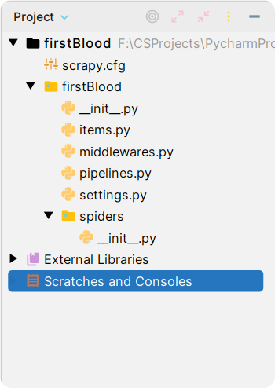
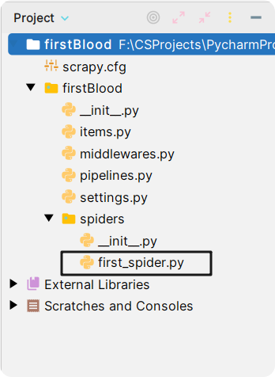
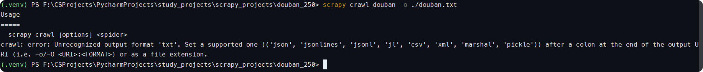

<h1 style="font-family: 'Menlo'; text-align: center;">scrapy</h1>

[TOC]

# 1 scrapy概念

- 什么是框架

  框架就是一个集成了很多功能并且有很强通用性的一个项目模板

- 如何学习框架

  专门学习框架封装的各个功能的详细用法

- 什么是scrapy

  爬虫中封装好的明星框架。功能：高性能持久化存储，高性能数据解析，异步数据下载，分布式

# 2 scrapy框架基本使用

## 2.1 环境安装：

`pip install scrapy`

## 2.2 创建工程（项目）

```python
scrapy startproject 项目名
```

创建成功后，目录结构：



**在项目文件夹下：创建爬虫文件：

`scrapy genspider 爬虫名称 起始url(后面可以修改)` -- 就会在`spiders`下面创建一个新文件，文件名就是我们在命令行写的那个爬虫名称。



执行工程：

`scrapy crawl 爬虫文件名称`  -- 比如 `scrapy crawl first_spider`

`spiders`: 爬虫目录，里面放置爬虫源文件

`settings.py`:一些配置信息

在发送请求之前，需要修改一些`settings.py`文件下面的配置信息：

在`settings.py`：


如果不想要显示日志信息：

`scrapy crawl 爬虫文件名称 --nolog` -- 但也不会显示错误信息 -- 在`settings.py`里面加上一个参数：

`LOG_LEVEL = 'ERROR'`

## 2.3 scrapy数据解析

需求：爬取`douban250`电影标题和评价信息

```python
# /spiders/douban.py

import scrapy


class DoubanSpider(scrapy.Spider):
    name = "douban"
    # allowed_domains = ["www.xxx.com"]
    start_urls = ["https://movie.douban.com/top250?start=0&filter="]

    def parse(self, response):
        # 解析 title + 名言
        li_list = response.xpath('//ol[@class="grid_view"]/li')
        for li in li_list:
            # xpath返回的元素一定是列表 但是列表中的元素一定是selector类型的对象
            # .extract()可以将selector对象中存储的字符串提取出来
            # title = li.xpath('.//div[@class="hd"]/a/span[1]/text()')[0].extract().strip()

            # 这条语句等价于title = li.xpath('.//div[@class="hd"]/a/span[1]/text()')[0].extract().strip()
            # 当你确保返回数据只有一个元素 你就可以用extract_first
            title = li.xpath('.//div[@class="hd"]/a/span[1]/text()').extract_first().strip()

            # xpath使用//text()可以获得列表 可能有多个元素
            # 列表调用extract，表示将列表中每个selector对象中data对应的字符串提取出来
            quotes = ''.join(li.xpath('.//div[@class="bd"]/div[@class="star"]//text()').extract()).strip().replace('\n',
                                                                                                                   ' ').replace("\t",
                                                                                                                                " ")
            print(title, quotes)

```

## 2.4 数据存储

两种方式：

- 基于终端指令 -- 只可用于`parse`方法存储到本地文本文件中 -- 将parser方法的返回值存储到文件中

  并且只能存储到指定类型的文件中：

  

  ```python
  scrapy crawl douban -o ./douban.csv
  ```

  ```python
  import scrapy
  
  
  class DoubanSpider(scrapy.Spider):
      name = "douban"
      # allowed_domains = ["www.xxx.com"]
      start_urls = ["https://movie.douban.com/top250?start=0&filter="]
  
      def parse(self, response):
          # 解析 title + 名言
          li_list = response.xpath('//ol[@class="grid_view"]/li')
          # 存储解析到的所有数据
          all_data = []
          for li in li_list:
              # xpath返回的元素一定是列表 但是列表中的元素一定是selector类型的对象
              # .extract()可以将selector对象中存储的字符串提取出来
              # title = li.xpath('.//div[@class="hd"]/a/span[1]/text()')[0].extract().strip()
  
              # 这条语句等价于title = li.xpath('.//div[@class="hd"]/a/span[1]/text()')[0].extract().strip()
              # 当你确保返回数据只有一个元素 你就可以用extract_first
              title = li.xpath('.//div[@class="hd"]/a/span[1]/text()').extract_first().strip()
  
              # xpath使用//text()可以获得列表 可能有多个元素
              # 列表调用extract，表示将列表中每个selector对象中data对应的字符串提取出来
              quotes = ''.join(li.xpath('.//div[@class="bd"]/div[@class="star"]//text()').extract()).strip().replace('\n',
                                                                                                                     ' ').replace("\t",
                                                                                                                                  " ")
              dict_save = {
                  'title': title,
                  'quotes': quotes
              }
              all_data.append(dict_save)
              # print(title, quotes)
          return all_data
  ```

  

- 基于管道

  - 编码流程

    - 数据解析

    - 在`item`类中定义相关属性

    - 将解析的数据封装存储到`item`类型的对象中 -- `items.py`

    - 将item类型的对象提交给管道进行数据存储 -- `piplines.py`

    - 在管道类的`process_item`方法中要将接收到的`item`对象中存储的数据进行持久化存储

      在配置文件中开启管道

面试题：如何将爬取到的数据一份存到本地 一份存到数据库，这个改如何实现？

-- 可以使用管道将其实现

定义两个管道类

## 2.5 全站数据爬取


