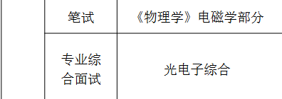

| 学校名称                                                     | 地区 | 软科 | 满足调剂要求？ | 网站                                        | 复试内容                                                     | 专业                                           | 人数   | 复试时间         | 线下/线上    | 性质 | 备注                                          |
| ------------------------------------------------------------ | ---- | ---- | -------------- | ------------------------------------------- | ------------------------------------------------------------ | ---------------------------------------------- | ------ | ---------------- | ------------ | ---- | --------------------------------------------- |
| [天津师范大学](https://xxgc.tjnu.edu.cn/info/1013/2920.htm)  | 天津 | 148  | √              |                                             | C++、DS                                                      | 计信学院--软件工程                             | 5      | 另行通知         | 线下         | 冲   | 关注通告                                      |
| [重庆理工大学](http://zs.yjs.cqut.edu.cn/info/1054/4830.htm) | 重庆 | 228  | √              | https://lxy.cqut.edu.cn/info/1048/10843.htm |  | 理学院 085401                                  | 有余额 |                  |              | 冲   | 关注通告,已填写预调剂 王老师 544132330@qq.com |
| [江苏师范大学](http://yjsc.jsnu.edu.cn/c7/24/c10936a378660/page.htm) | 江苏 | 125  |                |                                             | 上机考试-程序设计                                            | 人工智能(智慧教育学院)                         |        |                  | 线上         | 冲   | 已填写预调剂                                  |
| [上海应用技术大学](https://gs.sit.edu.cn/2024/0328/c5706a222994/page.htm) | 上海 | 259  |                |                                             | 理-工程光学、电气-信号与系统、机械-机械设计基础              | **电气、机械、 理学院--电子信息**         |        | 另行通知         | 线下         | 冲   |                                               |
| [聊城大学](https://phys.lcu.edu.cn/yjsjy/yjszs/550466.htm)   | 山东 | 239  |                |                                             | 模拟电子技术基础                                             | 085408光电信息工程                             |        | 查各招生学院网站 | 线下         | 冲   |                                               |
| [西安工业大学](https://cs.xatu.edu.cn/info/13885/193520.htm) | 陕西 | 249  |                |                                             |                                                              | 计算机技术、软工 （计算机科学与工程学院） |        |                  | 线上         | 冲   | 需要问 高老师 029-86173270                    |
| [北方民族大学](https://yjsc.nmu.edu.cn/info/1086/2000.htm)   | 宁夏 | 416  |                |                                             |                                                              | AI 085401                                      |        | 4.12-4.13        | 线下         | 冲   |                                               |
| [北京联合大学](https://graduate.buu.edu.cn/art/2024/3/27/art_30731_770781.html) | 北京 | 276  |                |                                             |                                                              | 城市智慧学院-电信                              |        | 4.11             | 线下         | 冲   |                                               |
| [北京信息科技大学](https://yanjiusheng.bistu.edu.cn/zsgl/zsxx/zsgg/202403/P020240329706024520952.pdf) | 北京 | 207  |                |                                             |                                                              | 大数据技术与工程 (经管 信管)              |        | 未知             | 线上（应该） | 冲   |                                               |
| 江苏大学                                                     | 江苏 | 78   |                |                                             |                                                              | 人工智能(汽车工程研究所)                       | 5-     |                  | 线上         | 冲   | 已在研招网上填写预调剂                        |
| [中国计量大学](https://yjszs.cjlu.edu.cn/info/1016/3579.htm) | 浙江 | 139  |                |                                             |                                                              | 电子信息(光学与电子科技学院)                   |        | 4.9-4.12         | 线下         | 冲   |                                               |
| [西北师范大学](https://yjsy.nwnu.edu.cn/2024/0405/c2701a227247/page.htm) | 甘肃 | 177  |                |                                             |                                                              | AI + 新一代电信                                | 11     | 4.12-4.14        |              |      |                                               |

> [!NOTE]
>
> 

> [!TIP]
>
> 

> [!IMPORTANT]
>
> 

> [!WARNING]
>
> 

> [!CAUTION]
>
> 
