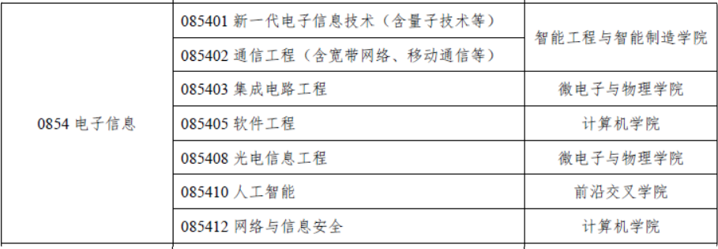
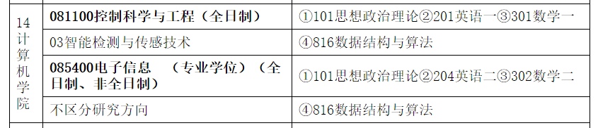
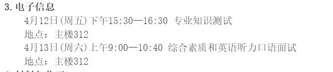
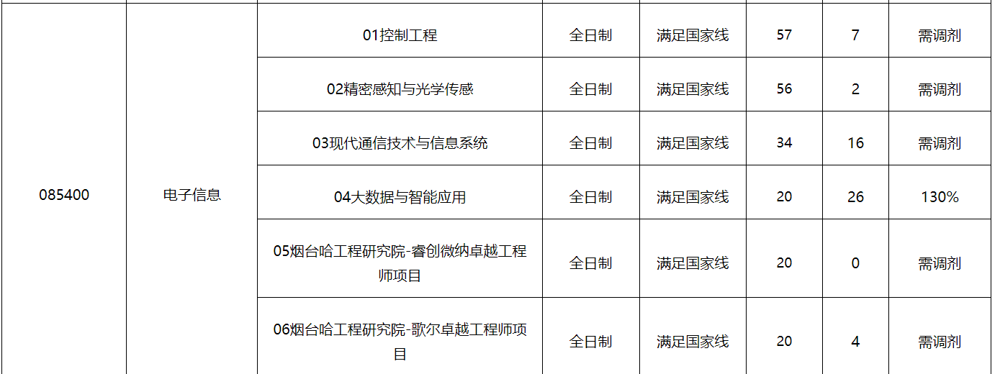

| 学校                                                         | 哪些专业有调剂名额                                           | 怎么报名                                                     | 调剂要求有哪些 | 调剂最低分有哪些 | 联系方式 |
| ------------------------------------------------------------ | ------------------------------------------------------------ | ------------------------------------------------------------ | -------------- | ---------------- | -------- |
| 河北农业大学                                                 | 信息技术与科学学院 085401 AI 非全日制                        | 研招网 4.8                                                   |                |                  |          |
| 北方民族大学                                                 | 085401新一代电子信息技术（含量子技术等）<br />085403集成电路工程 <br />085406控制工程 <br />085410 人工智能 | 研招网 4.8                                                   |                |                  |          |
| 河北大学                                                     | 083500 软工 （408）                                          | 研招网 4.8                                                   |                |                  |          |
| 重庆科技大学                                                 | 电气工程学院  控制工程、仪器仪表工程                         | 研招网 4.8                                                   |                |                  |          |
| [湖南工商大学](https://gra.hutb.edu.cn/p179/tzgg/20240329/158392.html) |  | 研招网4.8                                                    |                |                  |          |
| 西南科技大学                                                 | 计算机技术 软工                                              | 研招网4.8                                                    |                |                  |          |
| 重庆师范大学                                                 | AI 12人                                                      | 没找到导师信息 以这个网址为准：https://graduate.cqnu.edu.cn/ |                |                  |          |
| 安徽理工大学                                                 | 电子信息 非全日 联合培养（全日制）                           |                                                              |                |                  |          |
| 重庆工商大学                                                 | 人工智能学院 新一代电子技术、计算机技术、人工智能 共14人左右 |                                                              |                |                  |          |
| 上海科技大学                                                 | **×**英一数一 300+                                           |                                                              |                |                  |          |
| [辽宁工业大学](https://yjsxy.lnut.edu.cn/info/14363/184966.htm) | 电子与信息工程学院 085401 新一代电子信息技术                 |                                                              |                |                  |          |
| [上海应用技术大学](https://gs.sit.edu.cn/2024/0328/c5706a222994/page.htm) |  |                                                              |                |                  |          |
| [杭州电子科技大学](https://grs.hdu.edu.cn/2024/0328/c1721a262774/page.htm) | 电子信息 少量(<10)                                           |                                                              |                |                  |          |
| [北京林业大学](https://cos.bjfu.edu.cn/tzgg/f54f65ec242e459185d68fb45cf1f305.html) |  | 查看是否通过资格审查：http://tj.yzb.bjfu.edu.cn/adjustRegister/applyInfo/index# | 已发送邮件     |                  |          |
| 北京工商大学                                                 | 控制工程                                                     |                                                              |                |                  |          |
| [北京联合大学](https://graduate.buu.edu.cn/module/download/downfile.jsp?classid=0&filename=c318e97eb1d441eba16b7162f7f36926.pdf) |                                                              |                                                              |                |                  |          |
| [天津城建大学](https://ei.tcu.edu.cn/info/1261/3401.htm)     |                                                              |                                                              |                |                  |          |
| [西安理工大学](https://zdh.xaut.edu.cn/info/1004/3750.htm)   | 控制工程                                                     |                                                              |                |                  |          |
| [烟台大学](https://yjs.ytu.edu.cn/info/1016/2670.htm)        | 计算机技术 软工                                              | 请关注烟台大学研究生处网站（[https://yjs.ytu.edu.cn/](http://yjs.ytu.edu.cn/)）及研招网调剂系统的最新消息。[烟台大学2024年硕士研究生招生考试预计接收调剂专业.pdf](https://yjs.ytu.edu.cn/system/_content/download.jsp?urltype=news.DownloadAttachUrl&owner=1466391704&wbfileid=12270440) |                |                  |          |
| 西南石油大学                                                 | 后续调剂看这儿：https://www.swpu.edu.cn/dxy/yjsjy/yjszsxx.htm |                                                              |                |                  |          |
| [哈尔滨工程大学](https://yt.hrbeu.edu.cn/2024/0326/c11333a323068/page.htm) |                                                              |  |                |                  |          |
| 中国计量大学                                                 | 研招网上填                                                   |                                                              |                |                  |          |
| [太原科技大学](https://yk.tyust.edu.cn/info/1077/4126.htm)   |                                                              |                                                              |                |                  |          |
| [河北工程大学](https://yanjs.hebeu.edu.cn/info/1089/6593.htm) |                                                              |                                                              |                |                  |          |
| [北京信息科技大学](https://yanjiusheng.bistu.edu.cn/zsgl/zsxx/zsgg/202403/P020240329706024520952.pdf) |                                                              |                                                              |                |                  |          |
|                                                              |                                                              |                                                              |                |                  |          |
|                                                              |                                                              |                                                              |                |                  |          |
|                                                              |                                                              |                                                              |                |                  |          |
|                                                              |                                                              |                                                              |                |                  |          |
|                                                              |                                                              |                                                              |                |                  |          |
|                                                              |                                                              |                                                              |                |                  |          |
|                                                              |                                                              |                                                              |                |                  |          |
|                                                              |                                                              |                                                              |                |                  |          |

### 北京林业大学

```
# 北京林业大学
请参加复试的考生4月10日前将以下材料的电子版上传至我校研究生招生管理信息系统（http://tj.yzb.bjfu.edu.cn/），同时发送至各学科秘书老师的邮箱（生物物理学：史老师 biopbfu@163.com；数学：赵老师 zmhscu@163.com；电子信息：杨老师yangxh@bjfu.edu.cn；材料与化工：王老师chaolymer@163.com）。以上材料复印件复试当天上交给各学科秘书老师。

所提交的材料包括：

1.统考考生、联考类考生（应届本科毕业、往届本科毕业生）：①准考证；②有效身份证；③毕业证书原件（应届生提交学生证、本科阶段成绩单电子版，入学时交验毕业证）。

2.单独考试考生：要求同1，注意毕业时间必须满足本科毕业4年或4年以上。其提交的本科毕业证复印件（写上考生编号及姓名）要与原件进行核对。

3.“大学生志愿服务西部计划”志愿者考生：按1审查，同时查验①全国大学生志愿服务西部计划项目管理办公室统一制作颁发的《大学生志愿服务西部计划志愿服务证》；②《志愿服务鉴定书》；③服务单位证明。并留取以上材料的复印件。

4. 对通过资格审查的考生收取复试费100元/人。通过我校计划财务处统一收入结算平台缴纳（操作指南见附件）（请考生提供缴费截图，上传到我校研究生招生系统并发送到各学科秘书老师邮箱）。

5.诚信复试承诺书（见附件），要求亲笔签名。
```

