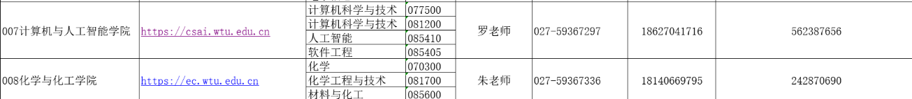

| 学校                                                         | 哪些专业有调剂名额                                           | 调剂名额是多少     | 调剂要求有哪些     | 调剂最低分有哪些     | 联系方式                                                     |
| ------------------------------------------------------------ | ------------------------------------------------------------ | ------------------ | ------------------ | -------------------- | ------------------------------------------------------------ |
| 桂林理工大学                                                 |                                                              |                    | 数学60+            |                      |                                                              |
| 临沂大学                                                     |                                                              |                    |                    |                      |                                                              |
| 东北石油大学                                                 |                                                              |                    | 可能跨专业         |                      |                                                              |
| 重庆理工大学                                                 |                                                              |                    |                    |                      | 电子信息 13368300121（吕老师）                               |
| [东北师范大学](https://yjsy.nenu.edu.cn/info/1123/5742.htm)  | 物理学院-电子信息                                            |                    |                    |                      | 教育部[“全国硕士生招生复试调剂服务系统”](https://yz.chsi.com.cn/yztj/)开通后，请考生登录系统进行相关操作。 |
| 鲁东大学                                                     | 信息与电气工程学院-人工智能                                  |                    |                    |                      | 0535-6659932 ，3 月 28 日“国家网上调剂意向采集系统”开通后，及时填报相关信息 |
| 上海应用技术大学                                             |                                                              |                    |                    |                      | 021-60873338                                                 |
| 合肥工业大学                                                 | 联培                                                         |                    |                    |                      | 0551-62919106                                                |
| [山东师范大学](http://www.yjszs.sdnu.edu.cn/info/1026/3685.htm) | 085401 新一代电子信息                                        |                    |                    |                      | 3.28，4.8开通后填写                                          |
| 太原科技大学                                                 |                                                              |                    |                    |                      |                                                              |
| **学校**                                                     | **哪些专业有调剂名额**                                       | **调剂名额是多少** | **调剂要求有哪些** | **调剂最低分有哪些** | **联系方式**                                                 |
| 宁波大学                                                     |                                                              |                    |                    |                      | 邮件已发送--询问                                             |
| 武汉纺织大学                                                 |                                                              |                    |                    |                      |                                                              |
| 宁夏大学                                                     |                                                              |                    |                    |                      | QQ 328599244                                                 |
| [兰州交通大学](https://dqxy.lzjtu.edu.cn/info/1197/11318.htm) | 自动化与电气工程学院                                         |                    |                    |                      | 0931-4938626                                                 |
| 南昌航空大学                                                 | 测试与光电工程学院 085408 光电信息工程                       |                    |                    |                      | 相关专业所在学院发布调剂公告后，考生可以在公告规定时间内登录中国研究生招生信息网（http://yz.chsi.cn/）的调剂系统提交申请。 |
| 西安工程大学                                                 |                                                              |                    |                    |                      | 已经发送邮件                                                 |
| 山东建筑大学                                                 | 待查看                                                       |                    |                    |                      |                                                              |
| **研招网有信息**学校                                         | **哪些专业有调剂名额**                                       | **调剂名额是多少** | **调剂要求有哪些** | **调剂最低分有哪些** | **联系方式**                                                 |
| 北京联合大学                                                 | 电子信息、软件工程                                           |                    |                    |                      | 导师联系信息看不到 ---- 已经在研招网写上了                   |
| 河北工业大学                                                 | 生物医学工程                                                 |                    |                    |                      |                                                              |
| 大连海事大学                                                 | 人工智能、软工、光电信息工程、大数据                         |                    |                    |                      | 由于咨询人数较多，如果十二小时内未回复，说明调剂希望较小，可尽快联系其他课题组，祝大家顺利上岸。 |
| 沈阳理工大学                                                 | 光电信息工程                                                 |                    |                    |                      |                                                              |
| 东北石油大学                                                 | AI、软工、仪器仪表、光电信息工程、通信工程                   |                    |                    |                      |                                                              |
| 黑龙江科技大学                                               | 控制工程                                                     |                    |                    |                      |                                                              |
| 上海应用技术大学                                             | 电子信息、智能计算与大数据                                   |                    |                    |                      |                                                              |
| 上海第二工业大学                                             | 电子信息                                                     |                    |                    |                      |                                                              |
| 上海科技大学                                                 | 电子信息                                                     |                    |                    |                      |                                                              |
| **研招网有信息**学校                                         | **哪些专业有调剂名额**                                       | **调剂名额是多少** | **调剂要求有哪些** | **调剂最低分有哪些** | **联系方式**                                                 |
| 江苏海洋大学                                                 | 新一代电子信息 控制工程                                      |                    |                    |                      | × 只需要学硕调剂                                             |
| 安徽理工大学                                                 | (非全日制) 电气与信息工程学院 -- 电子信息                    |                    |                    |                      |                                                              |
| 成都信息工程大学                                             | 目前研招网没有信息                                           |                    |                    |                      |                                                              |
| 中国计量大学                                                 | **×** 成绩300+                                               |                    |                    |                      | 在这个网址上行注册登录进行预调剂： http://graduatezs.cjlu.edu.cn/#/login/preadjust/enroll |
| 大连工业大学                                                 | 电子信息--光电信息工程、计算机技术                           |                    |                    |                      | 找不到导师联系方式                                           |
| 沈阳建筑大学                                                 | (005)电气与控制工程学院 (085400)(专业学位)电子信息 (00)不区分研究方向 |                    |                    |                      | 找不到导师！                                                 |
| 辽宁科技大学                                                 | 电子信息 计算机技术                                          |                    |                    |                      |                                                              |
| 辽宁工业大学                                                 | 计算机技术(非全日制)                                         |                    |                    |                      |                                                              |
| 东北师范大学                                                 | 211 全日制 电子信息                                          |                    |                    |                      |                                                              |
| 江苏大学                                                     | 汽车工程研究院 (085410)(专业学位)人工智能               |                    |                    |                      |                                                              |
| 江苏科技大学                                                 | 海洋学院 电子信息 非全日制                                   |                    |                    |                      |                                                              |
| 南方科技大学                                                 | 电子信息                                                     |                    |                    |                      |                                                              |
|                                                              |                                                              |                    |                    |                      |                                                              |
|                                                              |                                                              |                    |                    |                      |                                                              |
|                                                              |                                                              |                    |                    |                      |                                                              |
|                                                              |                                                              |                    |                    |                      |                                                              |
|                                                              |                                                              |                    |                    |                      |                                                              |
|                                                              |                                                              |                    |                    |                      |                                                              |
|                                                              |                                                              |                    |                    |                      |                                                              |
|                                                              |                                                              |                    |                    |                      |                                                              |
|                                                              |                                                              |                    |                    |                      |                                                              |
|                                                              |                                                              |                    |                    |                      |                                                              |
|                                                              |                                                              |                    |                    |                      |                                                              |
|                                                              |                                                              |                    |                    |                      |                                                              |
|                                                              |                                                              |                    |                    |                      |                                                              |
|                                                              |                                                              |                    |                    |                      |                                                              |
|                                                              |                                                              |                    |                    |                      |                                                              |
|                                                              |                                                              |                    |                    |                      |                                                              |
|                                                              |                                                              |                    |                    |                      |                                                              |
|                                                              |                                                              |                    |                    |                      |                                                              |
|                                                              |                                                              |                    |                    |                      |                                                              |
|                                                              |                                                              |                    |                    |                      |                                                              |
|                                                              |                                                              |                    |                    |                      |                                                              |

补充：武汉纺织大学联系方式：

