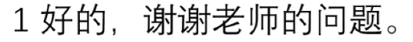
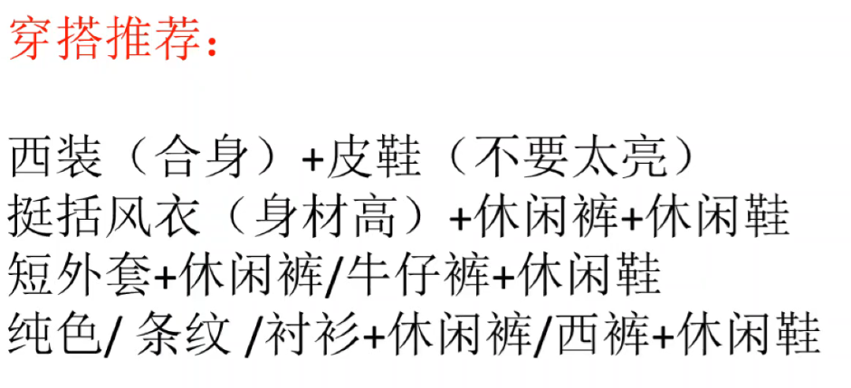
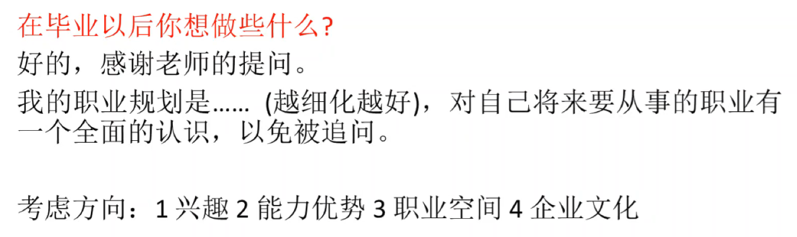
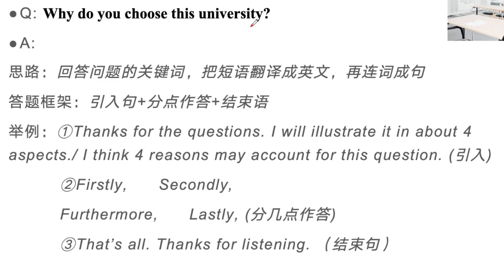
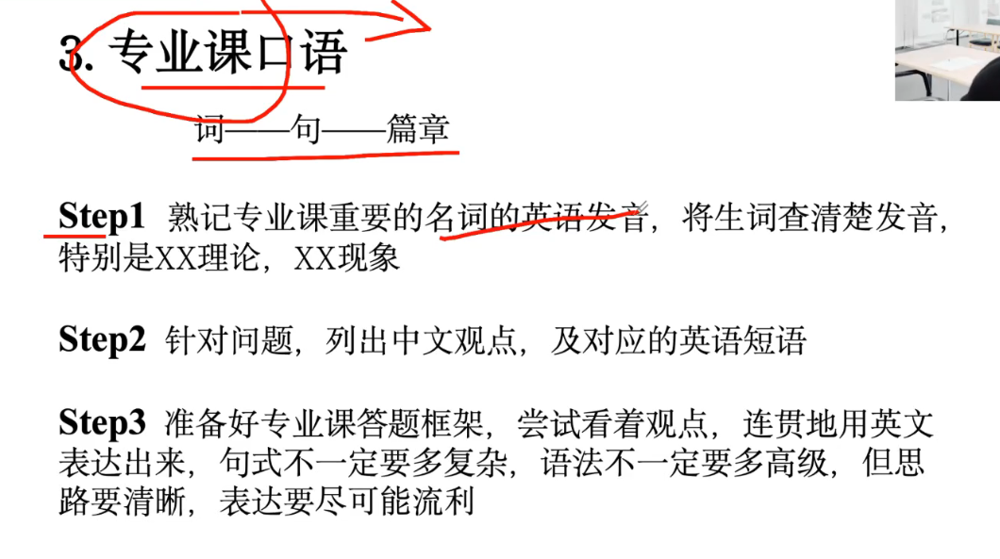
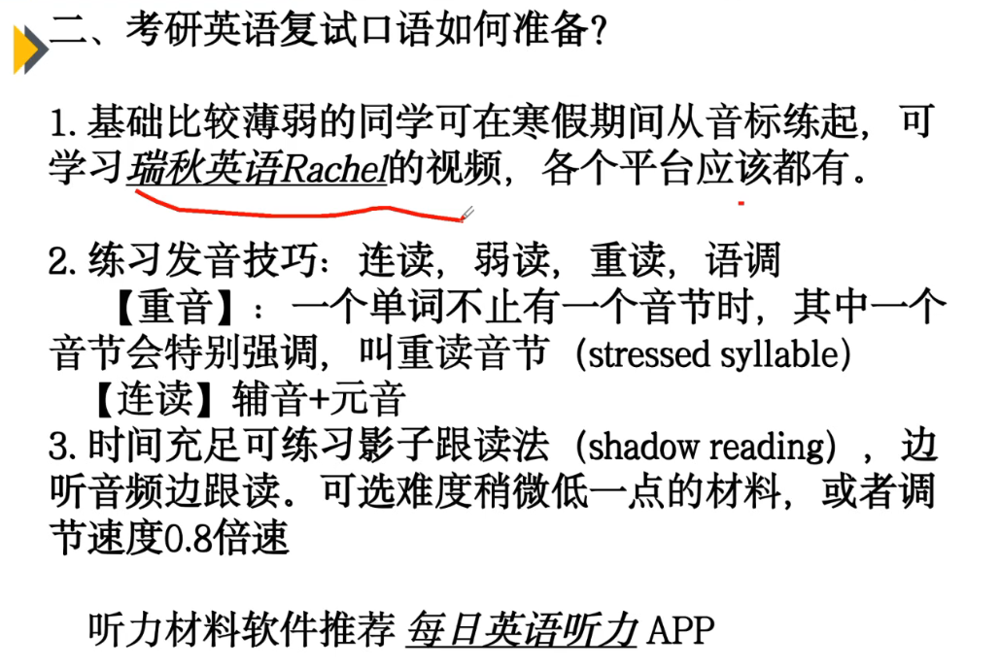
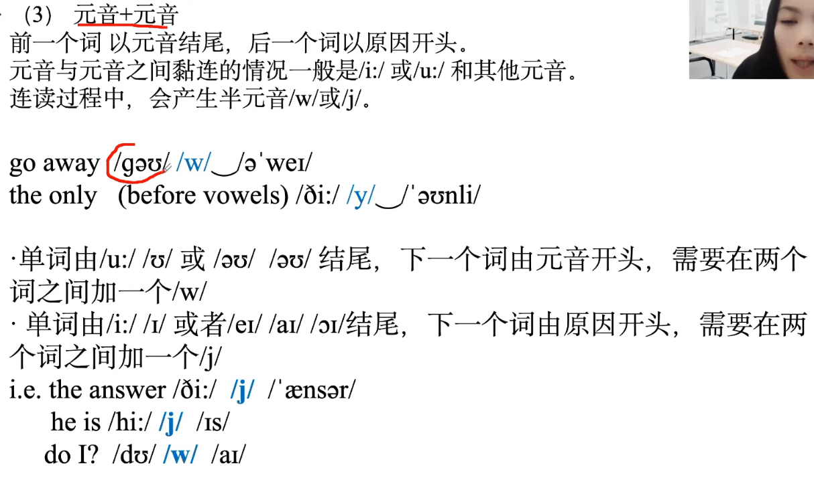
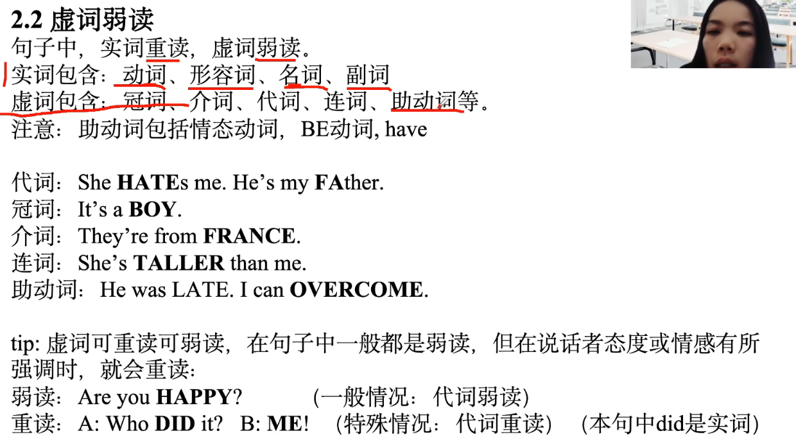

！！！在研究生阶段，自己有哪些短板需要补足，尽早确定，并努力做好。

1. 不管老师问什么中文问题，开头第一句都是：
2. 看一下学校的简介 校训 教授人数 博导人数 硕导人数 ...
3. 看一下导师的研究方向和研究内容 发的论文 获得的专利
4. 面试礼仪

    

4. 什么是真正优秀的论文 -- 如果不会写论文，去知网(CNKI)看这个专业领域非常牛的人写的论文 **多读几遍(四五遍) 甚至抄几遍**
    - 第一，推翻别人的观点，提出新的观点
    - 第二，把别人的研究更进一步
    - 第三，填补某一领域的空白
5. 什么是摘要
    - 摘要不是简单的`main idea`，不是`summary`
    - 摘要是: 小型论文的雏形，整个论文的框架写出来，**按照顺序将关键字罗列在一块写出来** -- 第一节写了...第二节写了...结论是...
    - 摘要： 摘要的顺序和逻辑要和论文主体严格一样
6. 为何要跨专业？
    - ...
7. 如果录取，研究生三年有什么规划
    
    - 研一阶段 -- 本科阶段有哪些知识不足，趁着研究生一年级期间要进行补缺，与此同时，要将研究生期间重要的基础理论知识掌握明白、透彻
    - 研一下学期到研二上学期开始准备论文，研二上学期准备论文的时候，考虑参加实习。
    - 研二阶段 -- 慢慢去开题，找到自己的研究方向，研二下学期去实习，研三上学期考虑读博或者就业
    - 研三上学期阶段 -- 完成毕业论文
8. 毕业以后想做些什么？
    

******

口语提问：为什么选我们学校？

要是听不懂老师问的是什么：

sorry, can you repeat it again?

