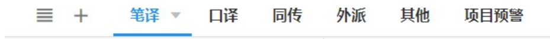
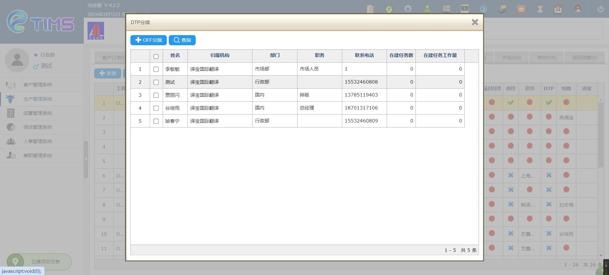
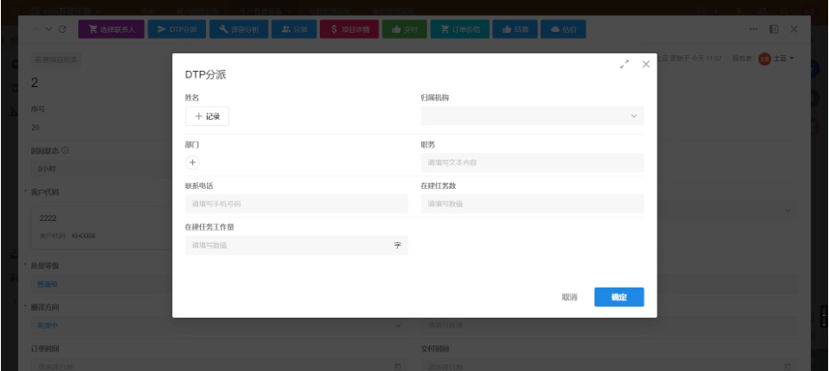
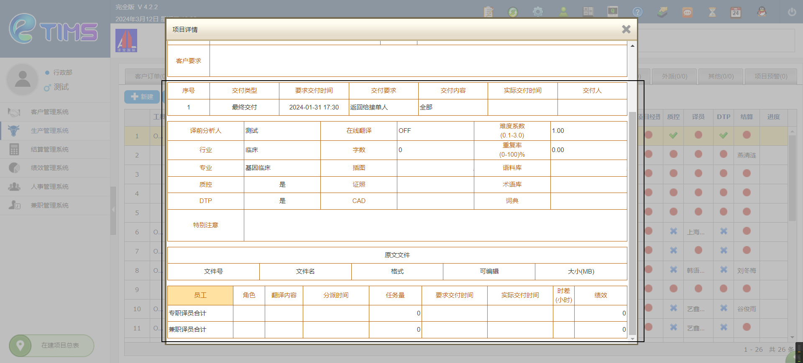

1. 【已完成未结算表】

    1. 警灯 有三种颜色 每种颜色什么意思 经过什么操作 警灯会变色

    1. 项目经理绩效

    1. 结算字段什么意思

2. 【已完成项目总表】
    1. 结算字段什么意思

## 一些疑问

1. 在旧系统中如下的样式:
    
    在明道云中做成如下图这样的样式是否可行：
    

2. 下面这张图显示的这些按钮：
    
    做成如下图所示的样式是否可行--明道云中称之为“视图”？
    

3. 旧系统中有些按钮点击之后，会显示如下所示的页面
    
    这个悬浮窗口可否做成如下图所示的样式：
    
4. 下面图片中方框框出的区域中的这些字段都有什么意思，哪些字段没有用？
    